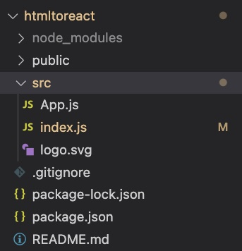
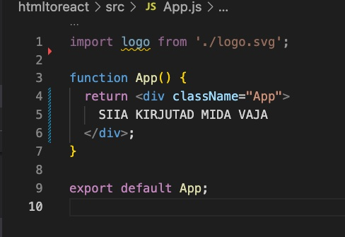
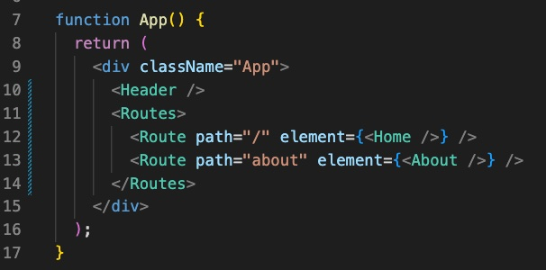

# Proge III sissejuhatav osa

**Ülesanne, leida fullstack setup**

## Express.js vs Next.js vs Nuxt.js

**Nexti ja Expressi** vahe selgitab ehk [see artikkel asjad rahuldavalt ära](https://merge.rocks/blog/next-js-vs-expressjs-which-one-to-use)  
Express vastutab vaid serveripoolse koodi eest, on väiksem, kiirem.
Nextis on seevastu kõik front-endi jaoks tarvilik juba olemas ja kui satuvad olema ka ülesande lahenduseks vajalikud back-endi jupid, siis peaks sobima. Seega jääb küsimus, kas temas sisalduv rahuldab ülesande vajadused.

Nuxt on sisuliselt Next'i Vuele vastav versioon.

[Nuxti kohta leiab](https://niharraoteblog.netlify.app/custom-express-server-nuxtjs) materjali, mis ütleb, et Nuxti server jääb nõrgaks, et hallata nt POST ja GET päringuid. See siiski ei vasta tõele, kuna netis on [konkreetsed juhised, kuidas Nuxtiga need päringud tööle panna](https://serversideup.net/post-put-and-patch-requests-with-nuxt-3/).

Põgusa googeldamise alusel võib esialgu seega väita, et nii Next kui Nuxt saavad üsna sama asjaga hakkama kui Express. Vahe vast siiski selles, et kui Next on Reactil baseeruv ja Nuxt Vuel, siis Express on selles suhtes sõltumatu. Võibolla annab see front-endi suhtes vabamad käed.

Aga nii Nexti kui Nuxti saab ka koos Expressiga kasutada.

Seega esimese mõttena tundub, et JS front-end raamistik (React või Vue) niikuinii kasutusele võtta, siis võib juba ka vastava SSR raamistikuga asja teha. Samas Express pole seotud kindla raamistikuga, mis võib olla eeliseks.

## Next + MySql test

[Õppevideo, HTML –> Next.js](https://www.youtube.com/watch?v=aYEFeYI7gUM)

## React

Stardiks Reacti proov:

```javascript
npx create-react-app@latest nimi
```

Stardis võib kogu src folderi tühjendada, jättes alles vaid `App.js` ja `index.js`

Järgmiseks võib kirjutada kogu tavalise html-i body osa App.js faili, funktsiooni return osasse:

CSS tuleks importida App.js faili, st

```javascript
import './styles/styles.css';
```

Kasutada võib muidugi ka scss-i, see kompileeritakse automaatselt

Fondid võib lisada nii `build` folderis olevasse index.html faili, nagu tavaliselt või `@import` abil css faili

Pildid lähevad `public`folderisse

Järgmiseks, juhul kui meil oli kopitud `App.js`-i tervik `HTML`, splitime selle komponentideks või kui polnud, siis loome uued komponendid – header, footer ja erinevad lehed jne – teem componentide folderi, et asjad sassi ei läheks.
Näide, `Home.js`:

```javascript
export default function Home() {
  return <></>;
}
```

See `<></>`on vajalik vanemelement

Ja seejärel impordime loodud komponendi või komponendid oma `App.js`-i ning returni all palume selle ka tagastada:

```javascript
import Home from './components/Home';
import './styles/styles.scss';

function App() {
  return (
    <div className="App">
      <Home />
    </div>
  );
}

export default App;
```

Järmiseks, et mitut lehekülge näidata, peame kasutusele võtma `React routeri` vt [reactrouter.com](https://reactrouter.com/en/main/getting-started/installation), et installida viimane versioon. Hetkel on see `npm install react-router-dom@6`

Seejärel pakime kogu oma webäpi routerisse, ehk siis `index.js` faili imporfime:

```javascript
import { BrowserRouter } from 'react-router-dom';
```

ning allpool pistame äpi `<App />` routerisse, ehk:

```javascript
<React.StrictMode>
  <BrowserRouter>
    <App />
  </BrowserRouter>
</React.StrictMode>
```

Seejärel impordime routeri ka `App.js`-i:

```javascript
import { Routes, Route } from 'react-router-dom';
```

Ja seejärel võime juba app faili oma nö roudid ehk teekonnad panna:

```
<Routes>
  <Route path="/" element={<Home />} />
  <Route path="about" element={<About />} />
</Routes>
```

Header komponendi impordime ja lisame `App.js`-is routside, teekondade peale:



Header komponenti impordime react routerist lingif (ma ei tea kuidas seda nimetada – lingi funktsioon vms)

```javascript
import { Link, NavLink } from 'react-router-dom';
```

Ja seejärel saame hakata linkima:

```javascript
<li>
    <Link to="/">
        <span class="logo">Home</span>
    </Link>
</li>
<li>
    <Link to="/about">About</Link>
</li>
```

Ja voilaa, ongi lihtne leht peamise navigatsiooniga valmis.

## Next.js

[Video](https://youtu.be/aYEFeYI7gUM?t=934)

```javascript
npx create-next-app@latest htmltonext
```

Next tuleb juba lehekülgedega. Leiad need pages folderist.  
Stardiks võib taas kustutada sealt index.js failist kogu sisu, ehk kõik peale `Head` komponendi.  
`_app.js` failis näitame ära, et kasutataks õiget stiilifaili.  
Vaatame, et stiilifolder oleks olemas kui vaja impordime oma.
Vaja on installida ka sass kui seda kasutad:

```javascript
npm i sass
```

Nüüd võime `index.js` faili, <Head /> kompnendi alla oma HTML-i kirjutada.  
Järgmise lehe võime teha lihtsalt koopia index.js-ist ja nimetada pmber, nt about.js ja muuta seal sisuosa nii kuis vaja

Erinevalt Reactist, teeme me siin aga lehe sisuosade jaoks komponendid. Nt Header. Selleks teeme uue komponentide folderi ja sinna teeme vajalikud kompionendid, nagu Reactis tegime. Seejärel impordime komponendid, antud juhul nt Headeri, kõikidele lehekülgedele.

Erinevalt reactist, on vaja komponentidesse, nt HEader kompnent, kus on lingid, importima ka nexti enda lingifunktsiooni:

```javascript
import Link from 'next/link';
```

ja kui Reactis on `Link to=...` siis Nextis on `Link href=...`  
Juhendis soovitas mees headeris link pista <a></a> elemendi sisse, kuid see tekitas errori, paistab et seda pole ka vaja

Pildid taas public folderisse.

## Tailwind + Next

Tailwindi juhendi nextiga kasutamiseks [leiab Tailwindi lehelt](https://tailwindcss.com/docs/guides/nextjs)
Tailwindi teema seadistamine:
[Fondid](https://tailwindcss.com/docs/theme)

Tailwindi jaoks on olemas VSCode pluginad, mis vihjavad, mis värve vms kasutada: Tailwind CSS IntelliSense

## Taaskasutatavad komponendid

Taaskasutatavate Reacti componentide tegemine – nupp.  
Nupu tegemine on juba lihtne, vaja teha lihtsalt nuüu komponent ja funktsioonis sulgudesse määrata muutujad, mida sul vaja muuta. Allpool näide, kus kaks nupustiili. Seda võibolla saab ka lühemalt kirjutada, peaks uurima:

```javascript
import React from 'react';

export function ButtonPrimary({ text }) {
  return (
    <button
      className="bg-blue-500 hover:bg-blue-700 text-white font-medium py-2 px-4 rounded"
      type="button"
    >
      {text}
    </button>
  );
}

export function ButtonSecondary({ text }) {
  return (
    <button
      className="bg-transparent hover:bg-blue-500 text-blue-700 font-medium hover:text-white py-2 px-4 border border-blue-500 hover:border-transparent rounded"
      type="button"
    >
      {text}
    </button>
  );
}
```

Antud näites on kasutatud Tailwindi klasse stiilimiseks. Komponenti võib importida ka oma stiilifaili [ja sel juhul tegutseda vastavalt sellisele](https://www.notimedad.dev/creating-reusable-react-buttons/) või [või sellisele juhendile (see viimane on peenem)](https://larainfo.com/blogs/create-reusable-button-component-with-react-tailwind-css)

Kaard saab samamoodi teha, kuid seal peab siis sisendväjad funktsiooni sulgudesse panema.

## Andmebaasiga ühendamine

[Õppevideo, andmebaasiga ühendamine](https://www.youtube.com/watch?v=aprLiG34b50)
