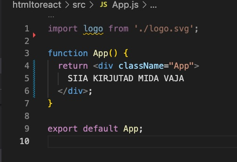
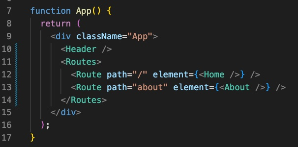

# React

[Videojuhend](https://youtu.be/aYEFeYI7gUM?t=223)

## Install

Stardiks Reacti proov:

```javascript
npx create-react-app@latest nimi
```

Stardis võib kogu src folderi tühjendada, jättes alles vaid `App.js` ja `index.js`

Järgmiseks võib kirjutada kogu tavalise html-i body osa App.js faili, funktsiooni return osasse:

CSS tuleks importida App.js faili, st

```javascript
import './styles/styles.css';
```

Kasutada võib muidugi ka scss-i, see kompileeritakse automaatselt

Fondid võib lisada nii `build` folderis olevasse index.html faili, nagu tavaliselt või `@import` abil css faili

Pildid lähevad `public`folderisse

## komponendid

Järgmiseks, juhul kui meil oli kopitud `App.js`-i tervik `HTML`, splitime selle komponentideks või kui polnud, siis loome uued komponendid – header, footer ja erinevad lehed jne – teem componentide folderi, et asjad sassi ei läheks.
Näide, `Home.js`:

```javascript
export default function Home() {
  return <></>;
}
```

See `<></>`on vajalik vanemelement

Ja seejärel impordime loodud komponendi või komponendid oma `App.js`-i ning returni all palume selle ka tagastada:

```javascript
import Home from './components/Home';
import './styles/styles.scss';

function App() {
  return (
    <div className="App">
      <Home />
    </div>
  );
}

export default App;
```

## Router

Järmiseks, et mitut lehekülge näidata, peame kasutusele võtma `React routeri` vt [reactrouter.com](https://reactrouter.com/en/main/getting-started/installation), et installida viimane versioon. Hetkel on see `npm install react-router-dom@6`

Seejärel pakime kogu oma webäpi routerisse, ehk siis `index.js` faili imporfime:

```javascript
import { BrowserRouter } from 'react-router-dom';
```

ning allpool pistame äpi `<App />` routerisse, ehk:

```javascript
<React.StrictMode>
  <BrowserRouter>
    <App />
  </BrowserRouter>
</React.StrictMode>
```

Seejärel impordime routeri ka `App.js`-i:

```javascript
import { Routes, Route } from 'react-router-dom';
```

Ja seejärel võime juba app faili oma nö roudid ehk teekonnad panna:

```
<Routes>
  <Route path="/" element={<Home />} />
  <Route path="about" element={<About />} />
</Routes>
```

Header komponendi impordime ja lisame `App.js`-is routside, teekondade peale:



Header komponenti impordime react routerist lingif (ma ei tea kuidas seda nimetada – lingi funktsioon vms)

```javascript
import { Link, NavLink } from 'react-router-dom';
```

Ja seejärel saame hakata linkima:

```javascript
<li>
    <Link to="/">
        <span class="logo">Home</span>
    </Link>
</li>
<li>
    <Link to="/about">About</Link>
</li>
```

Ja voilaa, ongi lihtne leht peamise navigatsiooniga valmis.
